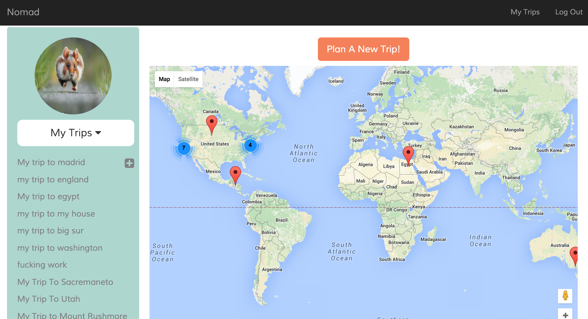
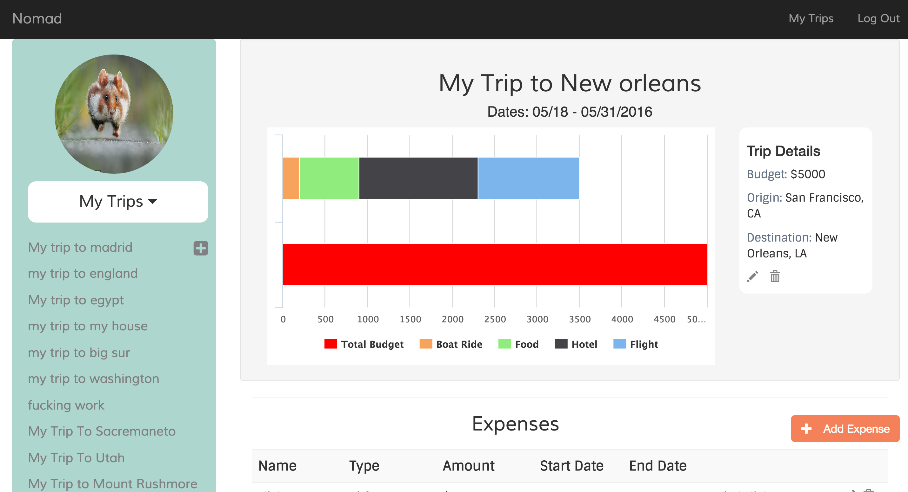
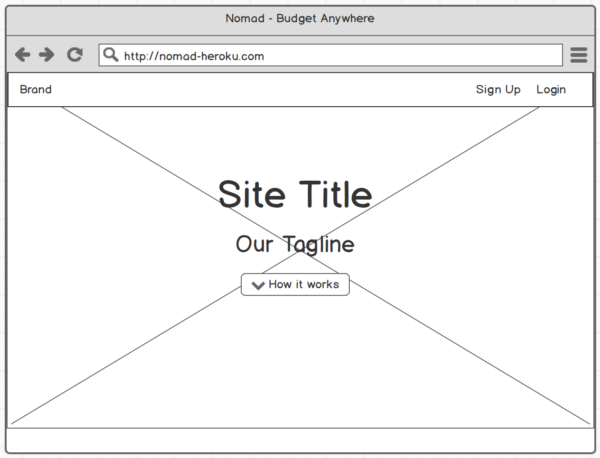
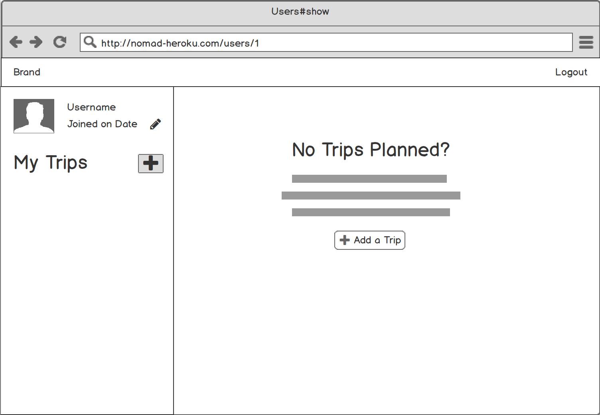
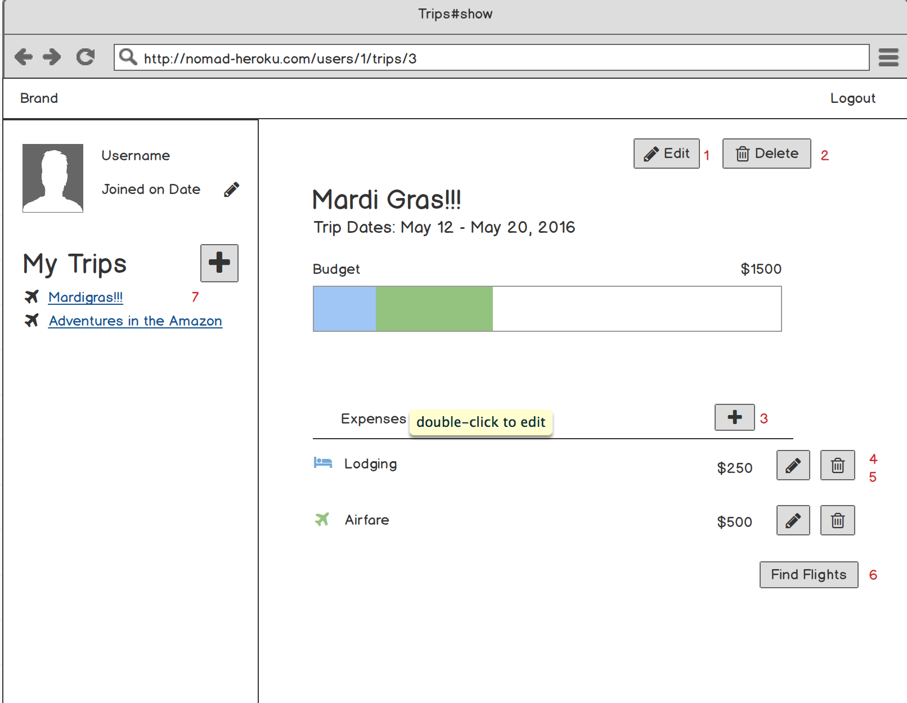

# Project Nomad

##### Nomad is your next travel budgeting app! Making it easy to keep track of your expenses for your next trip!

[Find it on Heroku] (https://travel-nomad.herokuapp.com/)

---

### Technologies Used
* Ruby on Rails
* PostgreSQL
* Active Record
* HTML/CSS
* Rspec
* JQuery
* Highcharts
* Google Maps API
* Carrierwave
* HTTParty

---

### Future Development
* Integrate the Sabre flight API so the user will be able to search flights within the app
* Integrate a hotel API so the user can search listings within the app
* Have a user put in a budget and have the app tell the user where he/she can go within thier budget

---

### Contributors
[Adriana Villagran](https://github.com/adrianavillagran)
[Ameer Brown](https://github.com/Ameer-Brown)
[Matthew Vilhauer](https://github.com/matthewvilhauer)
[Scott Madrid](https://github.com/samadrid92)

---

### Screenshots

#### Wireframes

#### User Stories
(https://goo.gl/y5ApXP)
